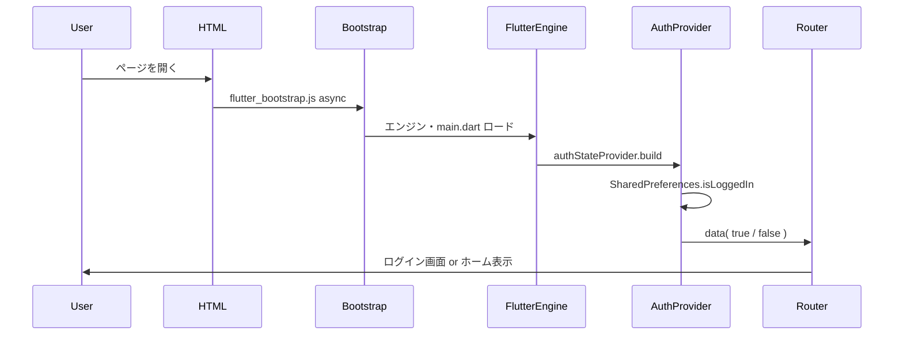

# 初回表示空白最適化方針

## 1. 目的と背景

初回表示時の白い空白時間を短縮し、ユーザーが「読み込み中」と認識しやすくすることで、体感待ち時間を減らし、離脱を防ぐことを目的とする。本方針は **Web** および **Android** 向けビルドを対象とする。

---

## 2. 現在の実装概要

初回表示から画面が利用可能になるまでの流れは以下のとおりである。

- **Web**: ブラウザが HTML を取得 → `flutter_bootstrap.js` を非同期で読み込み → Flutter エンジン・Dart コードのロード → アプリ起動 → 認証状態の取得（SharedPreferences）→ ルート（ログイン or ホーム）の描画。
- **Android**: ネイティブ起動画面（`launch_background.xml`）表示 → Flutter エンジン初期化 → 上記と同様に認証確認 → ルート描画。

---

## 3. 既に採用している最適化手段

| 手段                         | ファイル・場所                                                                                                        | 役割                                                                                                |
| ---------------------------- | --------------------------------------------------------------------------------------------------------------------- | --------------------------------------------------------------------------------------------------- |
| 認証中のローディング UI      | [lib/app.dart](../lib/app.dart) の `authState.when(loading: ...)`                                                     | 認証状態取得中に「読み込み中...」と `LoadingIndicator` を表示し、白画面ではなくフィードバックを出す |
| Web の非同期ブートストラップ | [web/index.html](../web/index.html) の `<script src="flutter_bootstrap.js" async>`                                    | HTML のパースをブロックせず、Flutter をロードする                                                   |
| Android 起動画面             | [android/app/src/main/res/drawable/launch_background.xml](../android/app/src/main/res/drawable/launch_background.xml) | Flutter 描画前の白背景を表示し、黒画面を避ける                                                      |
| PWA テーマ色                 | [web/manifest.json](../web/manifest.json) の `theme_color`・`background_color`                                        | ブラウザ UI や「ホームに追加」時のスプラッシュで見た目を統一                                        |

---

## 4. これから実施する最適化項目

### 4.1 Web ローディング用プレースホルダー（優先度: 高）

- **現状**: [web/index.html](../web/index.html) の `<body>` はスクリプトのみで、Flutter が初フレームを描画するまで**真っ白**のままである。
- **提案**: `<body>` 内にインラインのローディング UI（ロゴ・「読み込み中」テキスト・スピナー等）を HTML/CSS で記述し、アプリのテーマに合わせる。Flutter がマウントされたタイミングで、`flutter_bootstrap.js` のコールバックまたはアプリ側でこの要素を削除・置換する。
- **効果**: エンジン・JS ロード中も白画面ではなく「読み込み中」が表示され、体感の空白時間が短くなる。

### 4.2 ルートの Deferred ロード（優先度: 高）

- **現状**: [lib/router/app_router.dart](../lib/router/app_router.dart) で全画面（`LoginPage`、`HomePage`、各機能ページ）を通常の `import` で参照しているため、全ルート分のコードが初期バンドルに含まれる。Web では main の JS が大きくなり、初回のパース・実行時間が伸びる。
- **提案**: ログイン・ホーム以外のルートを `deferred as` でインポートし、該当ルートへ遷移する際に `loadLibrary()` で読み込む。go_router の `builder` 内で `FutureBuilder` 等でロード完了を待ってからウィジェットを返す。
- **効果**: 初期バンドルが小さくなり、初回表示〜インタラクティブまでの時間短縮が期待できる。各機能は初回アクセス時にのみロードされる。

### 4.3 スケルトン画面（優先度: 中）

- **現状**: ローディングは [lib/shared/widgets/loading_indicator.dart](../lib/shared/widgets/loading_indicator.dart) の `CircularProgressIndicator` のみ。
- **提案**: ホームや一覧系など、レイアウトが決まっている画面では、データ取得前にレイアウトに近い占位（タイトルバー・カードの枠など）を表示するスケルトンを用意する。
- **効果**: 「何かが表示されている」と感じやすく、心理的な待ち時間が短くなる。

### 4.4 その他（任意）

- **楽観的初回表示**: 認証未確定の間もいったんログイン画面を表示し、バックグラウンドで `authStateProvider` を解決する。既にログイン済みなら即 `/home` にリダイレクト。初フレームは早くなるが、ログイン → ホームの一瞬の切り替えが発生するため、 product の判断が必要。
- **重要リソースの preload**: [web/index.html](../web/index.html) で `flutter_bootstrap.js` やメインの JS に `<link rel="preload">` を付与し、取得開始を早める。効果はネットワーク次第。

---

## 5. 実施順序と依存関係

推奨する実施順序は次のとおりである。

1. **Web プレースホルダー** … 変更が [web/index.html](../web/index.html) に限定され、効果が分かりやすい。まず実施する。
2. **ルート Deferred ロード** … [lib/router/app_router.dart](../lib/router/app_router.dart) および各画面の `import` を変更する。go_router の `builder` と組み合わせる必要がある。
3. **スケルトン** … 画面ごとに導入するため、ホームなど重要な画面から順次対応する。

既存の [lib/app.dart](../lib/app.dart) の認証ローディング（`authState.when(loading: ...)`）や [lib/features/auth/providers/auth_provider.dart](../lib/features/auth/providers/auth_provider.dart) はそのまま利用する。Web プレースホルダーは「HTML 表示〜Flutter 初フレーム」を埋め、認証ローディングは「Flutter 起動後〜認証完了」を埋めるため、役割が重複しない。

---

## 6. 検収と指標（任意）

効果測定の目安として、以下を検討できる。

- **Web**: 初回表示の白い空白時間（LCP や独自計測）、メイン JS の初回転送サイズ・パース時間、First Input Delay（FID）や Time to Interactive（TTI）の目安。
- **Android**: 起動から初フレーム表示までの時間、Cold start の計測。

計測方法は Flutter DevTools の Performance / Network や、Lighthouse 等を利用する。

---

## 7. 実施記録

本方針に基づき実施した最適化の内容を記録する。

### 7.1 実施した項目

| 項目                                 | 内容                                                                       | 対応セクション |
| ------------------------------------ | -------------------------------------------------------------------------- | -------------- |
| Web ローディング用プレースホルダー   | HTML 内に「読み込み中」＋スピナーを表示し、Flutter 起動後に削除            | 4.1            |
| プレースホルダー削除処理（Web のみ） | 初回フレーム描画後に `#flutter-loading` を DOM から削除                    | 4.1            |
| ルートの Deferred ロード             | ログイン・ホーム以外の 14 ルートを deferred 化し、遷移時に `loadLibrary()` | 4.2            |
| Debug 時の青いローディングバー非表示 | 画面上部の Flutter 標準の青いバーを CSS で非表示（Release では元々非表示） | —              |

### 7.2 変更・追加したファイル

- **web/index.html**
  - `<body>` 内に `#flutter-loading` のインライン HTML/CSS（スピナー＋「読み込み中...」）を追加。
  - `<head>` 内に、Debug 時の画面上部の青いローディングバーを非表示にする CSS を追加。
- **lib/main.dart**
  - `WidgetsFlutterBinding.ensureInitialized()` を呼び出し。
  - `addPostFrameCallback` で初回フレーム後に `removeLoadingPlaceholder()` を実行。
- **lib/core/utils/loading_placeholder.dart**（新規）
  - 条件付き import で Web / 非 Web を切り替え、`removeLoadingPlaceholder()` を提供。
- **lib/core/utils/loading_placeholder_web.dart**（新規）
  - Web 用: `document.getElementById('flutter-loading')?.remove()` を実行。
- **lib/core/utils/loading_placeholder_stub.dart**（新規）
  - 非 Web 用: 何もしないスタブ。
- **lib/router/app_router.dart**
  - ログイン・ホーム以外を `deferred as` でインポート。
  - `_deferredBuilder(libraryFuture, buildChild)` を追加し、各ルートの `builder` で `loadLibrary()` 完了後にページを表示。ロード中は `Scaffold` + `CircularProgressIndicator`。

### 7.3 ビルド結果

- `flutter build web` 実行後、`build/web/` に `main.dart.js_1.part.js` ～ `main.dart.js_15.part.js` が出力されることを確認。Deferred による分割が有効である。

### 7.4 未実施の項目

- **4.3 スケルトン画面** … 未実施。必要に応じて画面単位で追加する。
- **4.4 楽観的初回表示・preload** … 未実施。
